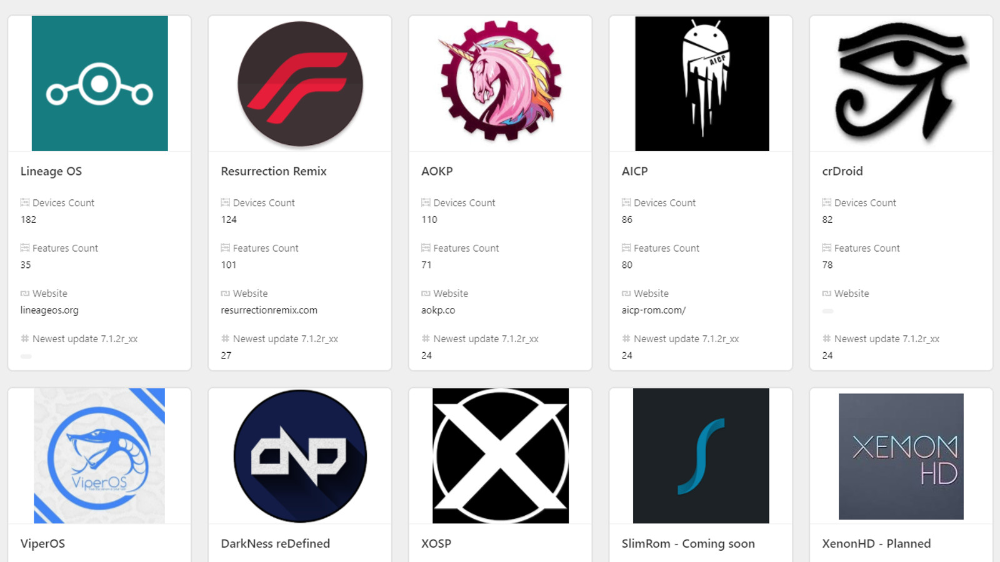

Android is an open source project (AOSP) that is used by many smartphones around the world. Its clean UI and simple usability makes it the perfect choice for most people who just wants a phone that "just works". But, being so open also has its disadvantage.

## The problem with Android (or Companies in general)

There are many smartphones from Samsung, Oneplus, Motorola, Google itself, etc. These companies take the vanilla AOSP codebase, implement it into their respective phones, like adding their own skins on top of clean android. 
For example, OxygenOS from Oneplus, OneUI from Samsung, MIUI from Xiaomi, and so on. An average user probably doesn't care for what UI is there on a smartphone. And that's fine. But people like me just can't deal with buggy mess such as MIUI or OxygenOS. Sure they might be improving but doesn't give the same fluidity that stock android from Google does.

Another issue is that, companies stop updating their own phones as soon as they launch the newer ones (or delay the updates).This means that your phone might stop recieving android updates and security fixes (I said might, if your company is generous enough to provide an update, then sure, enjoy :P ). They get lazy or are in a hurry to launch new products that old products never get an update from them. Personally happened to me on my Poco M2 Pro. They decided my phone was obselete within a year. I HAD to do something to get out of that mess. Oh and not to mention, the bloat it had because of MIUI.

Most Android companies be like:

## Custom ROMs to the rescue

Ah yes, my favourite part of all this. I will cut right to the chase.

Custom ROMs are modified 3rd party AOSP projects, made by the community for the community, to deliver what many companies couldn't, Android update support lol. It would be funny if it wasn't so sad...

People coming together, building up Software for their phones and then distributing it at free of cost! How cool is that? Here are examples of same of the custom ROMs: 

*LineageOS (formerly CyanogenMod)
Pixel Experience \
Havoc-OS \
AOSP Extended \
crDroid*

and tons of other roms as well.

You could even talk to the maintainers of these projects and report bugs or suggest new changes, in the most open source way possible :D . Here are the benefits of using a Custom ROM:

1. **Latest Android versions and security** : Well, as I mentioned before, your company might drop on you, but the community won't.

2. **More features than your stock ROMs**: Pretty self explanatory. Some may include more camera and navigation features. Other features are spoofing your phone to be a Pixel phone, so that you get all the pixel goodies with you. (something something unlimited google storage) And companies don't care if you install custom ROMs, it isn't illegal! Another example would be unlocking your phone's true potential my removing performance limitations your OEM must  have set on it on stock.

3. **Great community support**: I can't press on this enough. When you join the groups of your respective smartphone, you'll see how helpful people are (or I hope so atleast). You can contribute back to the community by reporting bugs and suggesting new features!

4. **Extend your phone's life**: By far the most useful advantage. I was able to use my old phone for 4+ years with consistent stability all thanks to custom ROMs. It felt like using a new phone all over again.

5. **It's just...fun?**: I always loved tinkering with my devices. So I find this super fun. Maybe you might too, who knows.

## The BAD about custom ROMs

Well, it's not all roses in the garden out here. It gets thorny as well ;-; 

1. **Pain of choosing the best ROM for you**: If your phone is well supported, there are like, probably atleast 7+ ROMs being built simultaneously for your phone. You'll probably be going to <u>**reset**</u> your phone a lot.

2. **Some companies don't like you messing around like that**: Samsung is one of those companies. It's very hard to get ROMs for them because they make it so hard to unlock your phone. Although Xiaomi, OnePlus and Google Pixel allow their phones to be unlocked and rooted without voiding your warranty, others are not very generous.

It's a risk if you don't know what you're doing, but it's a heck lot of fun once you get the hang of it. Trust me, I know. I first rooted my Nexus 7 tablet and installed CyanogenMod OS into it, then there hasn't been one phone which I own and did not install a custom ROM to. It's super fun!

Now, I'm not going to tell you how you can install custom ROMs on your device, there are tons of guides out there. I'm just trying to merely ask you to check them out if you're even a little tech savvy, trust me, it's a big rollercoaster ride out here. Enjoy it, or you know, use whatever you like! I'll be dropping some refs below for you to check it out:

https://en.wikipedia.org/wiki/List_of_custom_Android_distributions

https://www.xda-developers.com/tag/custom-rom/

https://www.reddit.com/r/Android/comments/16cbrn6/custom_rom_scene_in_september_2023_and_its_future/

https://www.reddit.com/r/PocoPhones/comments/wqt3j8/are_custom_roms_worth_it_what_are_the_pros_and/

P.S: Proud Owner of Oneplus 11, using crDroid:

  